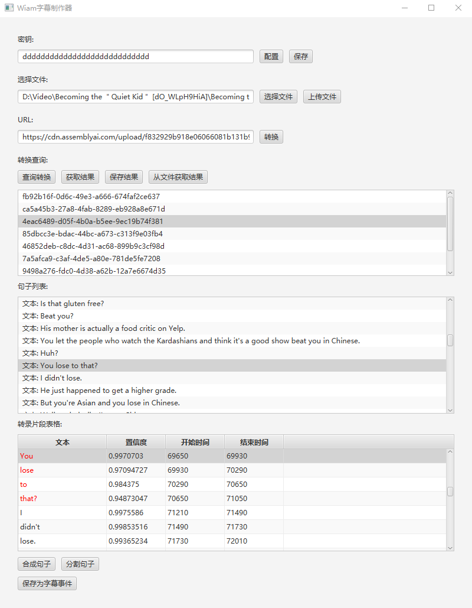

# WiamSubtitleMaker - Intelligent Subtitle Generator

[](https://kotlinlang.org/)
[](https://openjfx.io/)
[](https://gradle.org/)

**An intelligent subtitle generation tool based on AssemblyAI API, supporting speech recognition and subtitle editing**

[中文版 / Chinese Version](./readme.md)



## 📋 Project Overview

WiamSubtitleMaker is a powerful intelligent subtitle creation tool that utilizes AssemblyAI's advanced speech recognition technology to automatically generate high-quality subtitles for video content. The tool provides an intuitive graphical user interface, supports fine-grained editing and adjustment of subtitles, helping users quickly complete subtitle creation tasks.

## ✨ Key Features

- **Speech Recognition**: Integrated with AssemblyAI API, supporting high-quality speech-to-text conversion
- **Graphical Interface**: Intuitive JavaFX-based user interface, simple and convenient to operate
- **Subtitle Editing**: Supports fine-grained editing functions such as sentence merging and splitting
- **Multi-format Support**: Supports various audio/video formats as input, outputs standard ASS subtitle format
- **Real-time Preview**: Provides transcription segments and confidence information for quality control
- **Flexible Configuration**: Supports API key management and configuration saving

## 🚀 Quick Start

### System Requirements

- Java 21 or higher (with JavaFX included)
- Valid AssemblyAI API key
- Stable internet connection

### Installation Steps

1. Clone or download the project code
2. Ensure Java 21 or higher is installed
3. Build the project using Gradle:
   ```bash
   ./gradlew build
   ```
4. Run the application:
   ```bash
   ./gradlew run
   ```
5. Or package as an executable JAR file:
   ```bash
   ./gradlew shadowJar
   ```
   Then run the generated JAR file
6. Or simply download the release and double-click to run

### Configure API Key

1. Visit [AssemblyAI](https://www.assemblyai.com/) to register an account and obtain an API key
2. Enter the API key in the application interface and save it
3. The key will be automatically saved to the [config.json](./config.json) file

## 📖 Usage Guide

### 1. File Upload and Conversion

1. Click the "Select File" button to choose the audio/video file for which you want to generate subtitles
2. Click "Upload File" to upload the file to AssemblyAI servers
3. Click "Convert" to start the speech recognition process

### 2. Result Query and Editing

1. Click "Query Conversion" to get the list of conversion tasks
2. Select a conversion task and click "Get Results" to retrieve the sentence list
3. In the sentence list, you can view detailed transcription segment information

### 3. Subtitle Editing Features

- **Merge Sentences**: Select a sentence and click the "Merge Sentences" button to merge the current sentence with the next one
- **Split Sentences**: Select a specific transcription segment in a sentence, click "Split Sentence" to split the sentence at that point
- **View Association**: Sentence list and transcription segment table support linked selection

### 4. Export Subtitles

1. After editing, click the "Save as Subtitle Event" button
2. Choose the save location and filename
3. The system will generate Aegisub subtitle events
4. Copy to Aegisub for use

## 📁 Project Structure

```
WiamSubtitleMaker/
├── src/main/kotlin/                    # Source code directory
│   ├── AssemblyAIService.kt            # AssemblyAI API service wrapper
│   ├── Config.kt                       # Configuration management
│   ├── Main.kt                         # Application entry point
│   ├── Player.kt                       # Player component
│   ├── Sentence.kt                     # Sentence data structure
│   ├── SubtitleEvent.kt                # Subtitle event data structure
│   ├── TranscriptSegment.kt            # Transcription segment data structure
│   ├── WTime.kt                        # Time management
│   └── user_interaction/               # User interface interaction components
│       ├── DoForMessage.kt             # Message handling
│       ├── ListViewGenerator.kt        # List view generator
│       ├── Message.kt                  # Message type definitions
│       ├── ResultedButton.kt           # Responsive button
│       ├── TableViewGenerator.kt       # Table view generator
│       ├── UIComponentAction.kt        # UI component operations
│       ├── UIComponentData.kt          # UI component data
│       └── UIComponentDisplay.kt       # UI component display
├── src/test/kotlin/
│   └── Test.kt                         # Test file
├── build.gradle                        # Gradle build script
├── config.json                         # API key configuration file
├── gradlew                             # Gradle wrapper script
├── gradlew.bat                         # Gradle wrapper batch script
├── settings.gradle                     # Gradle settings
├── input/                              # Input files directory
├── output/                             # Output files directory
├── readme.md                           # Project documentation(Chinese)
├── readme_en.md                        # Project documentation(English)
└── ui.png                              # Interface screenshot
```

## ⚙️ Build Configuration

This project uses Gradle for build management, main dependencies include:

- Kotlin 2.0+
- JavaFX 21+
- Ktor HTTP client
- kotlinx.serialization
- AssemblyAI API client

## 🔧 Advanced Features

### Load Results from File
- Supports loading saved sentence lists from JSON files
- Click the "Load Results from File" button to select a JSON format sentence data file

### Confidence Check
- Transcription segment table displays confidence for each segment
- Helps evaluate transcription quality

### Subtitle Format Export
- Supports exporting generated subtitles in Aegisub-compatible format
- Generates standard subtitle events for easy further editing and use

## 🔒 Security Notes

- API keys are stored locally only, please properly safeguard your [config.json](./config.json) file
- Uploaded files will be transmitted to AssemblyAI servers for processing

## 🤝 Contributing

Welcome to submit Issues and Pull Requests to improve the project.

## 📄 License

This project is licensed under the MIT License - see the [LICENSE](./LICENSE) file for details

## 🙏 Acknowledgments

- [AssemblyAI](https://www.assemblyai.com/) - Providing high-quality speech recognition API
- [Kotlin](https://kotlinlang.org/) - Modern programming language
- [JavaFX](https://openjfx.io/) - Rich client application platform
- [Ktor](https://ktor.io/) - HTTP client for connecting to AssemblyAI API

## Author Declaration

- This project uses [AssemblyAI](https://www.assemblyai.com/) API for speech recognition
- AI coding assistant who helped create this mod: [Lingma](https://lingma.aliyun.com/lingma)